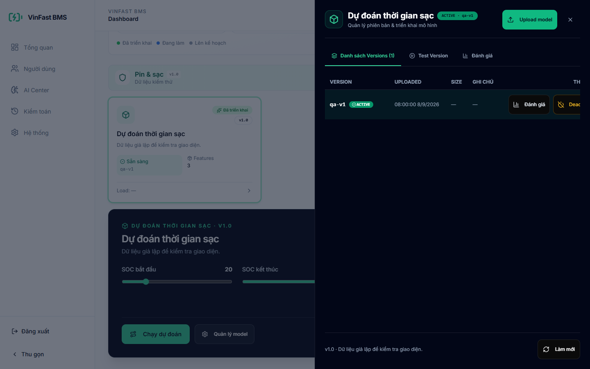

<div align="center">
  <a href="https://khanhbes.github.io/">
    
  </a>

  # KhanhBes — AI Engineer & Mobile Developer

  **A personal portfolio featuring applied AI, computer vision, mobile engineering, and intelligent IoT products.**

  [](https://khanhbes.github.io/)
  [](https://khanhbes.github.io/projects/)
  [](https://www.linkedin.com/in/phan-khanh-b22378290/)
</div>

---

## About this portfolio

This repository powers **[khanhbes.github.io](https://khanhbes.github.io/)**, my online engineering portfolio. It brings together selected projects, technical experience, education, and the systems I have built across artificial intelligence, computer vision, Flutter, backend services, and connected devices.

The site is designed as a lightweight static experience: responsive across screen sizes, easy to navigate, and deployable directly through GitHub Pages.

## Featured project

<div align="center">
  <a href="https://khanhbes.github.io/vinfast-battery/">
    
  </a>
</div>

### VinFast Battery — Smart EV Battery Platform

An AI-assisted mobile and IoT platform for understanding battery health, predicting charging time, tracking rides, and coordinating safer charging through Shelly relay control.

- Flutter mobile experience for battery, trip, and charging workflows
- Firebase authentication, synchronized data, and notifications
- AI-assisted SoC, SoH, range, and charging-time predictions
- Smart Charge orchestration with telemetry, safety cutoffs, and recovery
- Administration dashboard for users, vehicles, models, and audit history

[View the live case study](https://khanhbes.github.io/vinfast-battery/) · [Explore the source code](https://github.com/khanhbes/Vinfast-Batery)

## Selected work

| Project | Focus | Live case study | Source |
| --- | --- | --- | --- |
| **VinFast Battery** | EV battery intelligence, Flutter, Firebase, AI, IoT | [Open project](https://khanhbes.github.io/vinfast-battery/) | [Repository](https://github.com/khanhbes/Vinfast-Batery) |
| **Real-time Emotion Recognition** | YOLOv12, facial emotion recognition, Edge AI | [Open project](https://khanhbes.github.io/projects/emotion-recognition/) | [Repository](https://github.com/khanhbes/Emotion-Recognition-YOLOv12) |
| **Traffic Violation Detection** | Object detection, multi-object tracking, real-time alerts | [Open project](https://khanhbes.github.io/projects/violation-detect/) | [Repository](https://github.com/khanhbes/Violation-Detect) |

## Engineering stack

<p align="center">
  
  
  
  
  
  
  
  
  
</p>

## Repository structure

```text
.
├── index.html                    # Main portfolio
├── projects/                     # Project gallery and case studies
│   ├── emotion-recognition/
│   ├── violation-detect/
│   └── vinfast-battery/
├── vinfast-battery/              # Stable public alias for the EV case study
├── experience/                   # Experience page
└── assets/                       # Images, styles, scripts, and project media
```

## Run locally

```bash
git clone https://github.com/khanhbes/khanhbes.github.io.git
cd khanhbes.github.io
python -m http.server 8000
```

Then visit [http://localhost:8000](http://localhost:8000).

## Contact

- GitHub: [@khanhbes](https://github.com/khanhbes)
- LinkedIn: [Phan Khanh](https://www.linkedin.com/in/phan-khanh-b22378290/)
- Email: [khanhnhim21102004@gmail.com](mailto:khanhnhim21102004@gmail.com)

---

<div align="center">
  <sub>Designed and developed by <a href="https://github.com/khanhbes">KhanhBes</a>.</sub>
</div>
